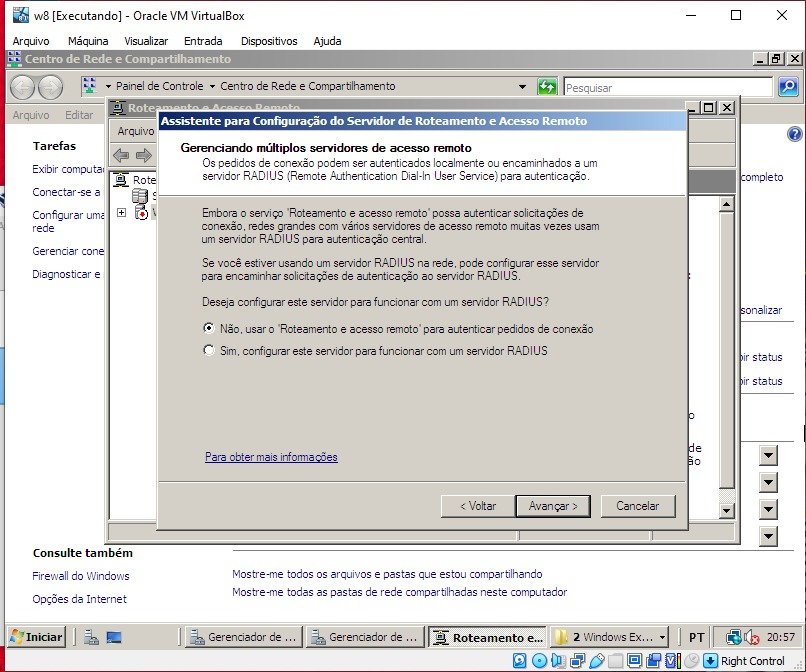
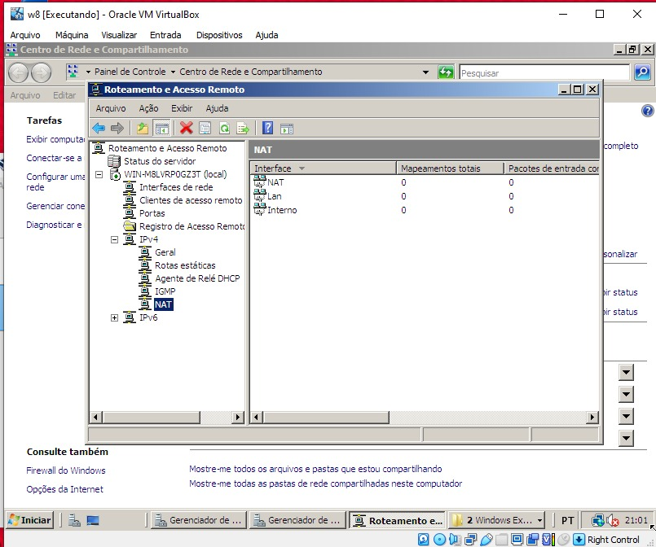

<head>
<body>
<h1>
     
      Criação de Servidores com VirtualBox
</h1>

  
### Explicação dos Tópicos

## 1. Propriedades do Sistema
- **Acessar Propriedades**: O "Painel de Controle" do Windows permite que os usuários acessem configurações do sistema, incluindo informações sobre o hardware e software.
- **Nome do Computador**: É o nome que identifica o dispositivo na rede. Ele pode ser alterado para facilitar a identificação.
- **Alterar Nome do Computador**: O nome pode ser modificado para algo mais significativo, como incluir parte do RA (Registro Acadêmico) do usuário, ajudando na identificação em ambientes de rede.

## 2. Endereço IP
- **Verificar Endereço IP**: O endereço IP (Internet Protocol) é um identificador exclusivo para cada dispositivo na rede, permitindo a comunicação entre eles.
- **Propriedades e Gerenciar Conexões de Rede**: A seção de propriedades permite que os usuários visualizem e gerenciem as configurações de rede, como IPs, gateways e DNS.

## 3. Dispositivos de Rede
- **Configurações de Rede**: Envolve a configuração e gerenciamento de dispositivos que se conectam e comunicam dentro da rede.
- **Switch NAT / Rede Interna**: Um switch NAT (Network Address Translation) permite que dispositivos em uma rede local compartilhem uma única conexão de internet, traduzindo endereços IP internos para um único IP externo.

### 
### 

## 4. Funções do Servidor
- **Clicar na Maleta**: Refere-se a acessar as funções administrativas do servidor.
- **Adicionar Funções**: Processo para incluir novos serviços ou funções em um servidor, como gerenciamento de usuários ou recursos.
- **Serviços de Domínio AD (Floresta Nova)**: O Active Directory (AD) é um serviço que gerencia identidades e relações em uma rede, e uma "floresta" é a coleção de um ou mais domínios.

## 5. Promoção do Controlador de Domínio
- **`dcpromo`**: Comando usado para promover um servidor a controlador de domínio, permitindo que ele gerencie a autenticação e autorização de usuários em uma rede.

## 6. Configurações de DNS
- **DNS (Domain Name System)**: Sistema que traduz nomes de domínio em endereços IP. 
- **Zona de Pesquisa Inversa**: Um tipo de configuração no DNS que permite traduzir endereços IP de volta para nomes de domínio.

## 7. Configuração de DHCP
- **DHCP (Dynamic Host Configuration Protocol)**: Protocolo que automaticamente atribui endereços IP e outras configurações de rede a dispositivos em uma rede, facilitando a conexão.

### 

## 8. Configuração WINS
- **WINS (Windows Internet Name Service)**: Serviço que resolve nomes NetBIOS em endereços IP, permitindo que dispositivos Windows se comuniquem em uma rede.

## 9. Gateway
- **Conectar a Servidores**: O gateway é um dispositivo que conecta redes diferentes, possibilitando a comunicação entre elas e com a internet.

## 10. DHCP - Super Escopos
- **Super Escopos**: Uma configuração que permite agrupar escopos DHCP para gerenciar endereços IP de uma forma mais organizada e eficiente.

## 11. Componentes de Hardware
- **Adicionar Placa de Rede (TCP)**: Refere-se à instalação física de uma placa de rede em um computador, que permite a conexão à rede.
- **Configurações dentro da interface da VM**: A interface de uma Máquina Virtual (VM) permite configurar adaptações de rede para simular um ambiente de rede.

## 12. Configuração do Roteador
- **Software**:
  - Configurar **Rede**.
  - Acessar **Sistemas Operacionais**.
  - Configurar **VPN**.
  - **Distribuir Acesso à Internet** (RAS).
 
### 

## 13. RADIUS
- **RADIUS (Remote Authentication Dial-In User Service)**: Protocolo que fornece autenticação, autorização e contabilidade para usuários que se conectam a uma rede.

### 
 
## 14. Faixa de IPs
- **Definir Faixa de Endereços IP**: Estabelecer um intervalo de endereços IP que serão utilizados para os dispositivos na rede, garantindo que não haja conflitos.

## 15. Criação dos Servidores
- **Ambiente de Virtualização**: A criação dos servidores foi realizada em uma **VirtualBox**.
- **Sistema Operacional**: O sistema operacional utilizado foi o **Windows Server 2008 Enterprise**.

### 
